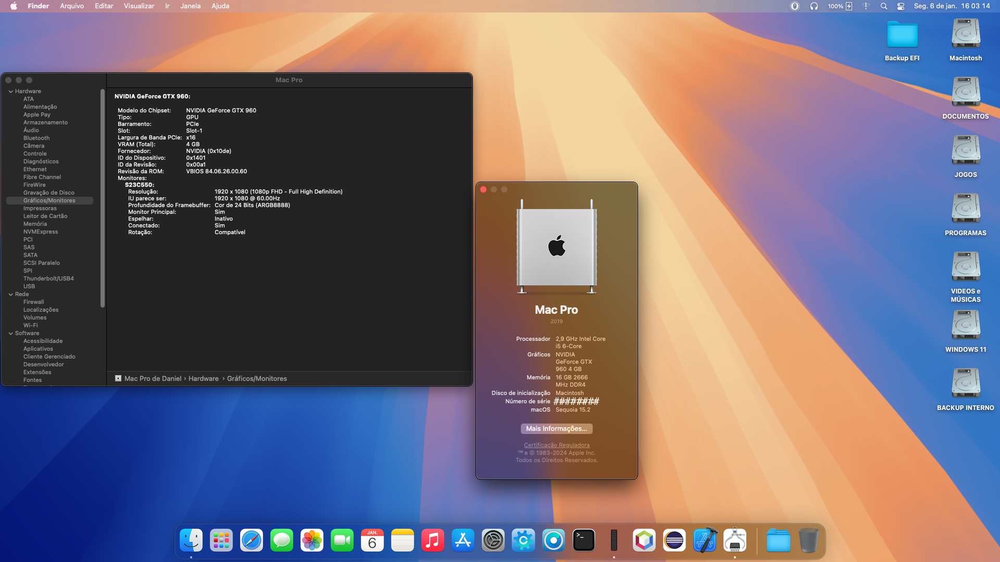

# Hackintosh no Gigabyte Z390 Gaming X

Basic   | Especificação
-------:|:-------------------------
CPU     | Intel i5 9400F
Chipset | Z390
GPU     | Nvidia GTX 960 4 GB
Memory  | 16 GB
Release Date | June 2019

__Versão:__

-> Opencore: 1.0.2

-> Open Legacy Patcher 2.2.0 

-> Mac OS Sonoma e Sequoia

__O que está funcionando:__

-> Áudio (ALC)

-> Vídeo (Aceleração 3D)

-> Gerenciamento de Energia

-> Ethernet

-> O sistema está estável, sem travamentos.

__Obs__:
n/a

